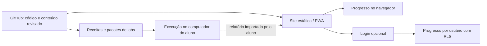

# AIOps Academy — proposta da V1 pública

Data: 2026-09-07 · Revisão: 2 · Status: aprovado pelo mantenedor; implementação incremental iniciada.

Esta é uma especificação para construção e inclui funcionalidades ainda não entregues. A beta pública local `1.2.0-beta.1` cobre somente os itens identificados no README e no changelog; não transforma todo este plano em produto pronto.

## 1. Produto e público

Uma academia aberta de operações, infraestrutura e agentes de IA, orientada a resolver problemas reais com evidências. O acesso ao conteúdo será gratuito, incluindo aprofundamentos. O computador do aluno executará os laboratórios que exigem serviços, bancos, containers ou modelos. Não será necessário alugar servidor para seguir o percurso essencial.

A formação atenderá iniciantes e profissionais que desejam ampliar competências. A progressão será por domínio demonstrado, sem prometer emprego, senioridade ou equivalência com graduação. A Academy não emitirá certificação profissional.

Agentes para operações internas fazem parte do escopo, em uma trilha própria. AIOps aplicado à infraestrutura continua sendo o núcleo; automação de processos e operação de sistemas de IA são especializações relacionadas. Um agente será ensinado como componente de um processo com limites, estado e avaliação, e não como autoridade para executar qualquer ação.

## 2. Base existente e reconciliação

O marco local 1.1.0 tem 30 aulas, 12 manuais, 11 simuladores, 60 questões, seis configurações de prova, notas, revisão, portfólio e backup. Usa FastAPI, React/TypeScript e SQLite para uma pessoa. A evidência histórica está em [VALIDATION](../VALIDATION.md); ela não comprova a futura versão pública.

Há trabalho posterior incompleto: seis módulos de aprofundamento, exercícios Python e uma alteração da biblioteca. A integração e a validação desses arquivos não estão concluídas. O primeiro incremento deve reconciliar esse trabalho e preservar o banco e os backups existentes, antes de ampliar funcionalidades.

O repositório [carlos-h-gomes/aiops-academy](https://github.com/carlos-h-gomes/aiops-academy) foi criado público e vazio em 2026-09-07. Código, documentos locais, licenças e workflows ainda não foram publicados.

## 3. Escopo curricular da V1

Meta editorial: 50 unidades-base — as 30 atuais revisadas e reorganizadas, mais 20 novas — e seis aprofundamentos opcionais já iniciados. A quantidade é escopo de autoria, não estimativa de duração. Cada unidade terá objetivo observável, pré-requisitos, explicação, exemplo, prática, pistas, solução comentada, verificação e referências.

| Trilha | Unidades-base | Conteúdo e entrega prática |
| --- | ---: | --- |
| Infraestrutura e AIOps | 30 existentes, revisadas | Linux, redes, Git/Python, Ansible/AAP, observabilidade, Dynatrace/DQL, OpenTelemetry, incidentes, SLI/SLO, AWS S3/Lambda/OpenSearch, GCP, containers, Kubernetes e fundamentos de operação de IA. Entrega: investigar e recuperar um serviço com evidências. |
| Dados, SQL e RAG | 6 novas | Modelagem relacional; SQL e joins; PostgreSQL e índices/EXPLAIN; transações, backup e restore; embeddings e busca vetorial com pgvector; RAG com citações, avaliação e controle de acesso. Entrega: recuperar um banco e explicar por que uma resposta está ou não sustentada pelos dados. |
| Segurança operacional | 6 novas | Identidade e menor privilégio; segredos e proteção de dados; redes e hardening; segurança de containers e dependências; detecção/resposta/recuperação; segurança de agentes e documentos recuperados. Entrega: corrigir uma configuração vulnerável e demonstrar recuperação em ambiente isolado. |
| Agentes e processos | 8 novas | Mapeamento de processos e regras versus agentes; modelos e ferramentas; saídas estruturadas e ferramentas; estado, avaliação e aprovação; quatro casos aplicados: desenvolvimento, atendimento, marketing e financeiro. Entrega: automatizar etapas de um processo sintético com testes, rastreabilidade e revisão. |

Os seis aprofundamentos tratam correlação de eventos, capacidade/FinOps, anomalias sazonais, drift/MLOps, LLMOps/agentes e resiliência/canary. Sobreposições com as trilhas serão ligadas por pré-requisitos e desafios, evitando repetir a mesma aula para inflar o catálogo.

Para cada aula, a interface identificará o tipo de prática: exercício leve, simulação, ferramenta real local ou provedor externo. Aulas de serviços proprietários/gerenciados terão uma alternativa gratuita com limites explícitos; uma simulação de AWS ou Dynatrace não será apresentada como uso real desses produtos.

### Agentes em processos: quatro cenários da V1

| Área | Processo sintético | Papel da IA | Verificação e limite |
| --- | --- | --- | --- |
| Desenvolvimento | Triar um bug, consultar código de exemplo e propor correção | Explicar hipótese e preparar patch | Testes e revisão do diff; nenhuma publicação automática em repositórios reais |
| Atendimento/operações | Classificar chamados e buscar runbooks | Recuperar evidências e preparar resposta | Citação verificável, recusa sem evidência e encaminhamento humano |
| Marketing | Transformar um briefing fictício em rascunho de campanha | Redigir alternativas e identificar afirmações sem suporte | Checklist editorial, dados fictícios e aprovação; sem postagem ou envio real |
| Financeiro | Conciliar lançamentos de CSVs fictícios e explicar divergências | Classificar descrições e sugerir investigação | Código calcula valores e reconciliação; pessoa revisa exceções; sem pagamentos ou dados bancários reais |

O aluno aprenderá permissões por ferramenta, validação de entrada/saída, idempotência, timeout, orçamento de execução, trilha de auditoria, retomada, desligamento e aprovação humana. Documentos, tickets e respostas de modelos serão entradas não confiáveis. Aprovação e regras financeiras serão impostas pelo código, nunca apenas por prompt.

A distinção entre fluxo predeterminado e agente com decisões dinâmicas orienta a escolha da solução. Frameworks serão apresentados depois desse fundamento. [Workflows e agentes](https://docs.langchain.com/oss/python/langgraph/workflows-agents), [revisão humana](https://docs.langchain.com/oss/python/langchain/human-in-the-loop).

O módulo de modelos e ferramentas comparará Codex, Cowork, Gemini CLI, Ollama, modelos locais e ferramentas de orquestração como n8n e LangGraph. O percurso obrigatório não dependerá de contas pagas. Os labs de agentes usarão Python e um perfil de inferência local opcional, com versão/modelo/licença fixados após medição. Replays serão claramente identificados como demonstrações, sem alegar inferência real. Integrações completas com todas as ferramentas ficam para expansões.

## 4. Progressão e ritmo

| Faixa de competência | O que a pessoa demonstra | Evidência na V1 |
| --- | --- | --- |
| Júnior | Seguir runbook, coletar sinais, executar mudança simples e reconhecer quando escalar | Labs guiados e relato do resultado |
| Pleno | Investigar incidentes comuns, automatizar com testes e operar com autonomia delimitada | Variações sem roteiro completo e projeto integrado |
| Sênior | Comparar hipóteses, avaliar risco, desenhar prevenção e coordenar investigação técnica | Desafios de incidentes e decisões justificadas |
| Especialista | Definir padrões e arquitetura, avaliar plataformas, confiabilidade e custo em escala | Estudo de arquitetura com trade-offs e rubrica de revisão |
| Coordenador | Priorizar, gerir capacidade e incidentes, comunicar impacto e desenvolver pessoas | Oficina de priorização, comunicação e plano de equipe |

Especialista e coordenador são ramificações, não uma fila obrigatória de promoções. A V1 oferece base prática de júnior/pleno, desafios de sênior e oficinas introdutórias das duas ramificações. Formações extensas para liderança e especialização ficam para versões posteriores.

Ritmo padrão proposto: 45–60 minutos, cinco dias por semana. Alternativas: 20–30 minutos; 90–120 minutos; ou intensivo personalizado. Etapas longas serão divisíveis e retomáveis. O plano de 30 dias permanecerá como opção de imersão em infraestrutura/AIOps, não como prazo para concluir as quatro trilhas.

A carga será calculada a partir dos módulos escolhidos e ajustada por pilotos. Reduzir horas diárias deve estender o calendário, não ocultar esforço. O aluno poderá pausar, trocar prioridade e reagendar sem perder histórico. Diagnóstico inicial orientará sugestões, sem bloquear acesso ao conteúdo.

## 5. Laboratórios distribuídos

Um negócio fictício comum conectará API, banco, telemetria e processos. Dados serão sintéticos. Cada cenário terá uma versão guiada e uma variação, com pistas graduais e solução explicada.

Quatro pacotes reais são o alvo da V1, totalizando pelo menos 13 cenários:

| Pacote | Formato | Cenários mínimos |
| --- | --- | --- |
| Sistemas e Ansible | VM Linux: receita reproduzível e appliance OVA validado | Serviço indisponível, configuração incorreta e mudança com restauração |
| Observabilidade | Docker Compose | Latência, erro em dependência e excesso de alertas; métricas, logs e traces |
| Dados e RAG | Docker Compose | Consulta lenta, restauração de dados e resposta RAG sem evidência/entrada maliciosa |
| Agentes e processos | Docker Compose | Os quatro processos sintéticos descritos na seção 3 |

Cada pacote incluirá checagem de pré-requisitos, início, falha controlada, verificação, parada e reset limitado aos recursos do lab. Terá versão, origem, hashes, requisitos medidos, limitações e instruções de recuperação. A receita deve permitir reconstrução quando o download do appliance estiver indisponível.

Suporte inicial pretendido: Windows x86-64 e Linux x86-64. Compatibilidade somente será anunciada após testes nos sistemas declarados. RAM, disco e tempos serão medidos por perfil; não são requisitos já garantidos. macOS/ARM serão classificados explicitamente enquanto não houver validação. Containers não reproduzem todo o comportamento de VMs ou nuvem gerenciada.

Kubernetes com kind, appliance de IA pesado e ISO própria ficam para a expansão. A V1 mantém aulas e simulações de Kubernetes; a trilha prática completa de cluster terá marco posterior. Laboratórios AWS/GCP reais serão opcionais, com recursos e limpeza descritos, executados na conta do aluno somente por decisão dele. O caminho essencial continuará sem cloud paga.

O site não executará comandos no computador. O aluno poderá importar um relatório sanitizado e limitado em tamanho, produzido pelo verificador local. Relatórios locais são evidência de prática declarada, não prova inviolável de autoria.

## 6. Aplicativo, acesso e experiência

- Conteúdo público e modo visitante sem login. Progresso local com exportação/importação; aviso claro sobre limpeza de dados do navegador.
- Conta opcional com login GitHub ou Google para sincronizar notas, tentativas e progresso entre dispositivos.
- Português, inglês e espanhol na interface e no conteúdo-base da V1. Traduções passam por revisão técnica e ficam vinculadas à versão da aula. Uma tradução incompleta será identificada, nunca exibida silenciosamente como atualizada.
- Tour curto e opcional no primeiro acesso, retomável na ajuda; orientação de sincronização após o primeiro login.
- PWA instalável no Android, com download escolhido de aulas, revisões e exercícios leves para uso offline. Labs Docker/VM continuam no computador. Publicação na Play Store fica fora desta V1.
- Catálogo por trilha, competência, pré-requisito, duração estimada, tipo de prática e hardware. Histórico de tentativas e portfólio exportável.
- Diretório de formação e credenciais externas: distinguir curso gratuito, badge, preparação gratuita e exame gratuito ou pago; informar data da conferência e critérios do provedor.
- Acessibilidade WCAG 2.2 AA como requisito: teclado, foco, leitor de tela, contraste, zoom, toque, redução de movimento e estados de erro/offline nos três idiomas.

## 7. Arquitetura proposta e custo

Preservar React/TypeScript para o cliente e FastAPI para a edição local. Publicar uma distribuição estática do cliente, sem tentar hospedar o servidor Python no GitHub Pages. Os modos local, visitante e conta usarão adaptadores de persistência; transporte fica em `api`, orquestração em `services` e acesso aos dados em repositórios apropriados. Não haverá importação de código entre frontend e backend.

Escolha proposta: Cloudflare Pages Free para o site, Supabase Free para autenticação e sincronização opcional, GitHub para código/contribuições e artefatos pequenos. Arquivos grandes devem respeitar cotas e termos do canal de distribuição; não irão para o histórico Git nem para o site estático.

GitHub Pages continua viável para um catálogo estático sem contas. Para o aplicativo com autenticação, preferimos a alternativa acima, considerando a orientação do Pages sobre transações sensíveis. Esta é uma decisão proposta de arquitetura, não uma contratação. [GitHub Pages: limites](https://docs.github.com/en/pages/getting-started-with-github-pages/github-pages-limits), [Cloudflare Pages](https://pages.cloudflare.com/), [limites do Pages](https://developers.cloudflare.com/pages/platform/limits/).

O alvo é operar sem fatura dentro das cotas gratuitas, sem prometer escala ilimitada. Antes da ativação, registrar cotas vigentes, responsável e ações: alerta a 70%, revisão a 85%, contenção de novas sincronizações antes do esgotamento, mantendo leitura local e exportação. Nenhum upgrade automático, API paga ou execução central de LLM. Retenção e tamanho por usuário serão limitados no serviço, com mensagens claras. [Supabase: planos](https://supabase.com/pricing).

### Dados e segurança

Supabase Auth identificará usuários e políticas RLS protegerão cada recurso no banco, inclusive quando acessado diretamente pela API. A chave administrativa não irá para o navegador. O cliente não poderá definir outro proprietário, elevar permissões ou validar sua própria autorização. OAuth usará redirecionamentos permitidos e escopos mínimos. [Auth](https://supabase.com/docs/guides/auth), [RLS](https://supabase.com/docs/guides/database/postgres/row-level-security).

Notas/tentativas terão IDs estáveis, proprietário e versão do conteúdo. Sincronização será idempotente, com estado pendente visível e tratamento de conflito; notas conflitantes não serão sobrescritas silenciosamente. Dados de contas diferentes não poderão se misturar em troca de sessão. Sair da conta removerá o cache pessoal desse usuário; material público baixado poderá permanecer. Dados locais de estudo não devem conter segredos corporativos.

O service worker guardará conteúdo público; não armazenará respostas autenticadas ou tokens em cache público. A implementação deverá tratar XSS, importação de backup, limites de tamanho/taxa, expiração de sessão, recuperação de falhas, exclusão de conta e exportação. Migração do SQLite/backup v1 exigirá cópia recuperável, mapeamento de IDs e testes de preservação.

O projeto coletará somente o necessário para conta e aprendizagem. Publicará uma explicação de dados/retensão/exclusão antes de abrir contas. Métricas de produto serão agregadas e limitadas, sem conteúdo de notas ou prompts. Privacidade, autenticação e isolamento terão revisão própria; infraestrutura gratuita não substitui essa validação.

## 8. Curadoria e comunidade

Cada aula terá ID, versão, competências, fontes oficiais, ferramentas testadas, data de revisão e relação com traduções. O processo de atualização verificará semanalmente links e releases selecionados e produzirá propostas para revisão. Não atualizará comandos, imagens ou traduções automaticamente. A interface mostrará a última revisão do conteúdo; o mantenedor verá falhas da rotina.

Contribuições usarão templates de problema do app, revisão de conteúdo/tradução e sugestão. A publicação exigirá revisão e validação dos labs afetados. Nenhuma contribuição poderá incluir dados de empresas, tokens ou logs sensíveis. Relatos de segurança seguirão o canal privado definido antes da publicação do código.

Licenciamento aprovado e aplicado localmente: MIT para código e CC BY 4.0 para conteúdo original. Ambos permitem reutilização, inclusive comercial, com as condições de atribuição e avisos correspondentes. Conteúdo e ferramentas de terceiros mantêm seus próprios termos; links não autorizam copiar manuais completos. [MIT](https://choosealicense.com/licenses/mit/), [CC BY 4.0](https://creativecommons.org/licenses/by/4.0/).

## 9. Entregas e critérios de aprovação técnica

O [backlog](V1-BACKLOG.md) organiza os incrementos. A sequência será: reconciliar a base; construir estrutura de trilhas e idiomas; validar um lab piloto; ampliar aulas e pacotes; implementar contas/PWA; concluir tradução, segurança e testes; preparar a publicação para revisão.

A V1 só poderá ser anunciada como pronta quando:

1. As 50 unidades-base e seis aprofundamentos tiverem prática verificável e revisão de fontes; os três idiomas do escopo estiverem revisados, sem lacunas silenciosas.
2. Os quatro pacotes iniciarem, reproduzirem seus cenários, verificarem recuperação e pararem/resetarem em ambientes limpos declarados, com requisitos medidos e redistribuição permitida.
3. O aluno puder ajustar ritmo, retomar atividades e migrar seu progresso anterior com evidência de preservação e restauração.
4. Duas contas de teste não puderem ler/alterar recursos entre si por interface, API direta ou troca de sessão. Importação, limites, OAuth e exclusão tiverem testes positivos e negativos.
5. A PWA for instalada e testada em Android, com uso offline, atualização de conteúdo e sincronização após reconexão. A interface passar revisão de acessibilidade automatizada e manual, nos tamanhos declarados e idiomas longos.
6. Os agentes forem avaliados em casos fixos, incluindo falta de evidência, entrada maliciosa, ferramenta negada, interrupção, repetição e aprovação recusada. Cálculos e autorização não dependerem de julgamento de modelo.
7. Build, dependências, licenças, segredos, infraestrutura, documentação, artefatos e CI tiverem evidências revisadas; nenhum achado de segurança alto/crítico estiver aberto.
8. Um piloto com iniciantes comprovar instalação e investigação em cenário novo; problemas impeditivos forem corrigidos e limitações remanescentes estiverem documentadas.

Gates separados de arquitetura, UX, segurança, dados, IA, custo, qualidade e release serão exigidos nos incrementos aplicáveis. O desenho atual não certifica a implementação futura.

## 10. Fora da V1 e decisão solicitada

Ficam para depois: tutor central pago, hospedagem dos labs de cada aluno, integrações com sistemas reais de empresas, agentes que enviam/publicam/pagam autonomamente, marketplace, turmas empresariais, certificado próprio, ranking de usuários, publicação na Play Store, ISO própria, suporte universal de hardware e trilhas completas de especialista/coordenador.

O mantenedor aprovou este escopo, a arquitetura, a sequência incremental e o licenciamento, acrescentando n8n, Apache NiFi e Power Automate. A implementação local está autorizada e iniciada. Publicação de código e ativação de serviços serão apresentadas com arquivos e configurações concretos para revisão; a criação do repositório vazio já autorizada não equivale a essa publicação.

Referência de pesquisa: [estudo de AIOps e ferramentas, 2026-09-07](../research/AIOPS-ACADEMY-ESTUDO-2026-09-07.md). As recomendações deste documento são decisões de produto para aprovação; números de escopo não são resultados de pesquisa de mercado nem entregas concluídas.

## Adendo aprovado — ferramentas de automação e Ops

n8n, Apache NiFi e Power Automate passam a ser temas explícitos da V1. A seleção é por capacidade e contexto, sem alegar ranking de mercado. O mapa inclui ainda Airflow, Temporal, Rundeck, OpenTofu, Argo CD e ferramentas de observabilidade. O primeiro incremento entrega quatro guias com exercícios de decisão; isso não equivale a laboratórios instalados desses produtos.

Os pacotes de Dados e Agentes receberão perfis de prática de NiFi e n8n, com versões fixadas, dados sintéticos e verificação. Power Automate terá roteiro opcional de ambiente Microsoft conforme conta/licença, acompanhado de alternativa sem assinatura. A contagem de 50 unidades-base permanece: comparativos e perfis se vinculam às unidades existentes; novos guias da biblioteca não são contados como novas aulas-base. Integrações reais com todas as demais ferramentas seguem como expansões.

## Adendo solicitado — fundamentos de entrega de software

Git/GitHub, branches, commits, pull requests, code review, GitHub Actions, CI/CD, testes, artefatos, ambientes, permissões de pipeline e rollback são fundamentos explícitos da V1. Conectam-se à aula-base 6 e aos módulos de automação, segurança e operação. Três guias adicionais da biblioteca e um exercício local de promoção iniciam essa cobertura; não alteram a contagem de 50 unidades-base.

A base comum também deve integrar Linux/Windows, terminal, redes/DNS/HTTP/TLS, Git, Python, JSON/YAML, APIs, identidade e segredos, bancos, containers, observabilidade, troubleshooting, documentação e custo. O aprofundamento é definido pelo papel e pré-requisito; a V1 não promete cobrir toda especialidade de TI.
